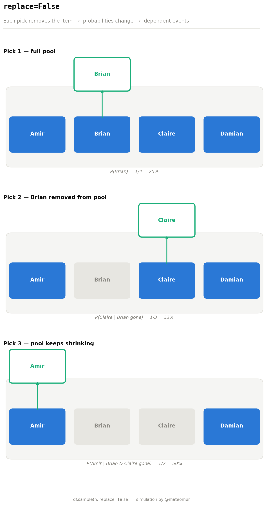
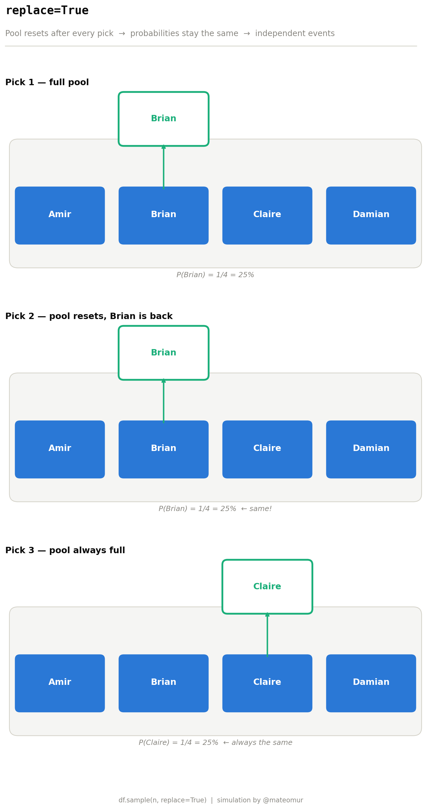

# Sampling With vs. Without Replacement — A Visual Simulation in Python

A from-scratch visualization that shows how one pandas parameter changes the entire statistical nature of your sample.




## What this shows

One parameter. One boolean. Completely different statistical behavior.

**`replace=False` — without replacement**
Once a row is picked, it's removed from the pool. Each draw changes the available options, so probabilities shift with every pick. Events become dependent on each other.

**`replace=True` — with replacement**
The pool resets after every pick. Probabilities stay exactly the same across all draws. Events remain independent.

| | `replace=False` | `replace=True` |
|---|---|---|
| Pool after pick | Shrinks | Resets |
| Probabilities | Change each draw | Stay the same |
| Events | Dependent | Independent |
| Use case | Random sampling | Bootstrapping |

## Why it matters

The binomial distribution — one of the most useful tools in statistics — only applies when trials are **independent**. If you sample without replacement and ignore that, your probability calculations are off.

Knowing which one to use isn't just a pandas detail. It's a statistical decision.

## Setup

```bash
git clone https://github.com/mateomur/sampling-replacement.git
cd sampling-replacement
python -m venv venv
source venv/bin/activate
pip install -r requirements.txt
python sampling_replacement.py
```

This generates both images in the current directory.

## Stack

- Python 3.x
- NumPy
- Matplotlib

## Author

**Mateo Murcia** — Data Scientist & Statistician
[LinkedIn](https://linkedin.com/in/mateo-murcia-27a816261) · [GitHub](https://github.com/mateomur)

---

*Part of a series where I revisit statistics fundamentals and build everything from scratch.*
